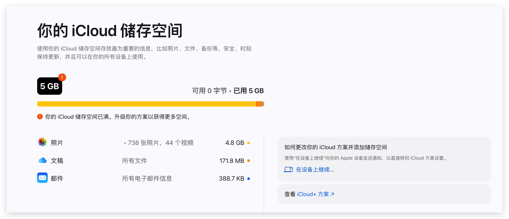

在使用 iPhone 的过程中经常弹出 iCloud 空间不足的提示，通常都是照片占据了存储的大多数，当然你可以通过购买 Apple 的服务来扩容 iCloud ，或者你也可以选择和我一样，将存量的照片导出清理。

## 备份你的照片到本地
- 你可以登录 https://www.icloud.com/ (国内使用 https://www.icloud.com.cn/) 打包下载你所有的照片；
- 然后在 iCloud 中删除所有的照片；

## 关闭照片的自动备份功能
- 在你的 iPhone 或 iPad上关闭 iCloud 的照片自动同步功能；
![[iOS-off-photo-sync.jpeg|300]]